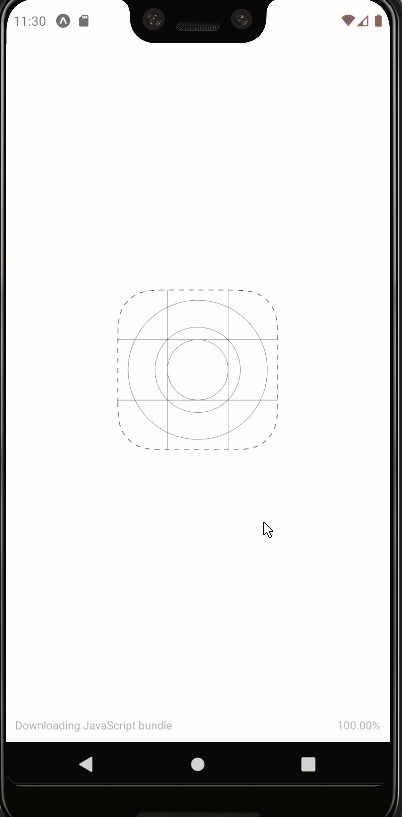

# React Native Swipe Animation

Proof of concept of a beautiful swipe animation made in react native. 

[Here it is](https://snack.expo.io/@nerychucuy/github.com-nerychucuy-react-native-swipe-animation) the Snack link to this app, where you can play with the web, androind and iOS version . In that link you will also find instructions to run the App on your device (through the Expo app).

## Running this project in your local environment

1. Clone repository
1. yarn install
1. yarn run web

## Resources
* This project was bootstrapped with [Expo](https://expo.io)
* For further info about react native projects built with Expo, check [Expo CLI quick start](https://reactnative.dev/docs/environment-setup).
* UX designed by [Alex Bender](https://dribbble.com/shots/6487913-Rosan-App-Swipe-Animation)
